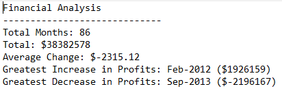
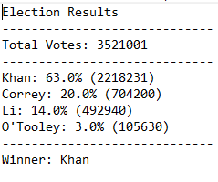

# GT Bootcamp Python Homework: PyBank &amp; PyPoll

## Table of Contents
1. [Introduction](#introduction)
2. [Objectives](#objectives)
3. [Technologies](#technologies)
4. [Files](#files)
5. [Results](#results)

### Introduction
This assignment includes two Python scripts. The PyBank Python script analyzes financial records the prints some summary data. The PyPoll Python script analyzes votes cast and prints the winner along with some summary data.

### Objectives
Write a Python script that:
1. PyBank
    * Reads in a CSV file of raw data
    * Calculates
        a. number of months
        b. net total amount of Profit/Loss
        c. average monthly change in Profit/Loss
        d. date & amount of greatest increase in profits
        e. date & amount of greatest decrease in losses
    * Prints the calculations to the terminal and to a new text file
2. PyPoll
    * Reads in a CSV file of raw data
    * Calculates
        a. number of votes cast
        b. list of candidates who received votes
        c. percentage of votes won by each candidate
        d. number of votes won by each candidate
        e. winner of the election
    * Prints the calculations & winner to the terminal and to a new text file

### Technologies
This project uses: 
* Python Version 3.6.13

### Files
* [budget_data.csv](PyBank/Resources/budget_data.csv): raw data file for PyBank code containing columns of Date and Profit/Losses
* [PyBank - main.py](PyBank/main.py): Python script created for the PyBank challenge
* [pybank_results.txt](PyBank/Analysis/pybank_results.txt): output text file from the PyBank Python script
* [election_data.csv](PyPoll/Resources/election_data.csv): raw data file for PyPoll code containing columns of Voter ID, County, and Candidate
* [PyPoll - main.py](PyPoll/main.py): Python script created for the PyPoll challenge
* [pypoll_results.txt](PyPyPoll/Analysis/pypoll_results.txt): output text file from the PyPoll Python script

### Results

* PyBank Example Results:

* PyPoll Example Results:
